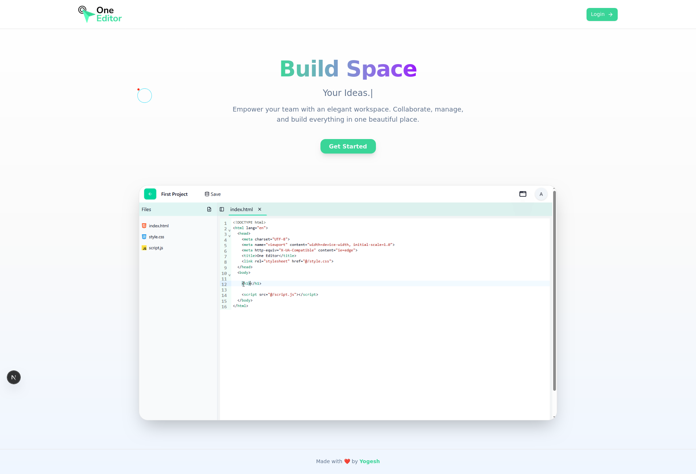

<h1 align="center">🚀 Full Stack Code Editor</h1>

<p align="center">
  A powerful and modern full-stack code editor built with Next.js, TypeScript, Tailwind CSS, and MongoDB. Supports real-time file management, live preview, and user authentication.  
</p>

<p align="center">
  
</p>

---

## 🌐 Live Preview


<p>

🔗 **Live Project**: [https://one-editor-pearl.vercel.app](https://one-editor-pearl.vercel.app)

> ✨ *Explore the full functionality with live login, project creation, and real-time code editing!*

---

## 🎥 Demo Screenshots

| Dashboard | Editor | Files |
|----------|--------|-------|
|  |  |  | 
 ||
---

## 🧠 Features

✅ **Authentication**
- Secure login and registration using NextAuth.js
- JWT + Credentials-based auth

✅ **Project & File Management**
- Create, edit, and delete projects
- Create new files per project (e.g., HTML, CSS, JS)
- Smart file viewer with file type detection

✅ **Code Editor with Live Preview**
- Auto-update preview in browser
- HTML/CSS/JS supported
- Clean split layout

✅ **Responsive UI**
- Built with Tailwind CSS and Shadcn UI
- Optimized for all screen sizes

✅ **Modern Architecture**
- TypeScript, App Router (Next.js 14+)
- Server actions & secure APIs

---

## 🧰 Tech Stack

| Category          | Technology |
|------------------|------------|
| **Frontend**      | React, Next.js 14+, Tailwind CSS, TypeScript, Zustand |
| **UI Library**    | Shadcn UI, Lucide Icons, Framer Motion |
| **Authentication**| NextAuth.js (JWT, Credentials) |
| **Backend**       | Next.js API Routes |
| **Database**      | MongoDB with Mongoose |
| **Preview Engine**| Iframe-based live render |
| **State Management**| Zustand |
| **Notifications** | Sonner |

---

## 📦 Installation & Setup

```bash
# 1. Clone the repo
git clone https://github.com/YogeshKumar-saini/one-editor.git

# 2. Install dependencies
pnpm install

# 3. Setup .env
cp .env.example .env
# Add your MongoDB URI, NextAuth secret, etc.

# 4. Run development server
pnpm dev
